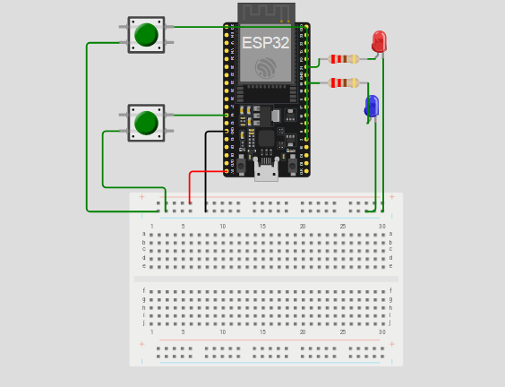

# ButtonToLED_Mapper
## 🔧 Project Description
This project demonstrates how to control two LEDs using two push buttons on an ESP32 .  
The behavior is as follows:

- **Button 1**: Toggles the two LEDs **alternately** at fixed intervals (one ON, the other OFF).
- **Button 2**: Makes both LEDs **blink together** at the same interval.

We approached the project using a **structured and scalable code design** by utilizing `struct` to map each button to its respective functionality. This makes the code cleaner and easier to extend in the future.

---

## 🧠 Code Architecture
- `struct ButtonMap` is used to map button pins to modes.
- `enum Mode` defines different behaviors (e.g., `TOGGLE_ALTERNATE`, `BLINK_TOGETHER`).
- The `loop()` checks which button was pressed and switches to the corresponding mode.
- LEDs are controlled based on the selected mode and a timer.

---

## 🔗 Simulation Link
[Click here to view the simulation](https://wokwi.com/projects/437702487176433665)

---

## 🖼️ Circuit Diagram / Simulation Screenshot
> *(Place your image here)*  

---

## ⚙️ Hardware Used
- ESP32 / Arduino Uno
- 2 × LEDs
- 2 × Push Buttons
- Resistors (220Ω for LEDs)
